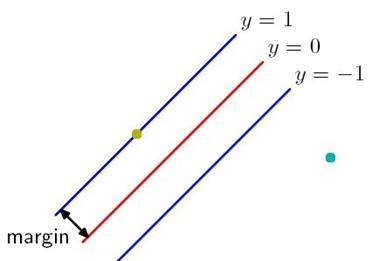
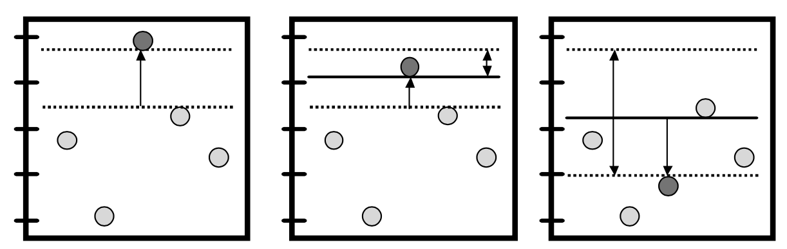
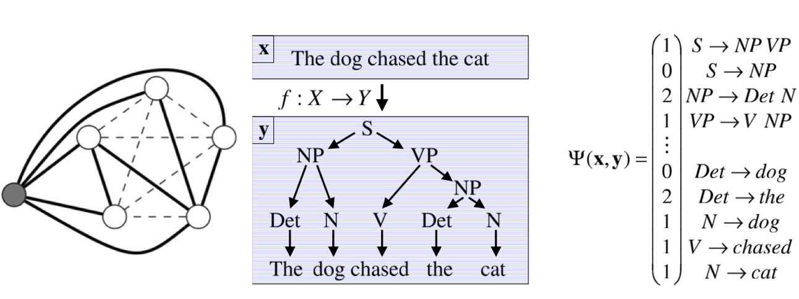
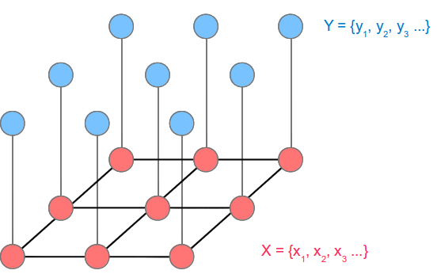
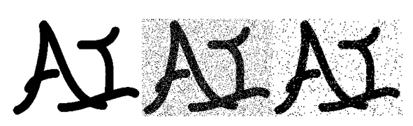
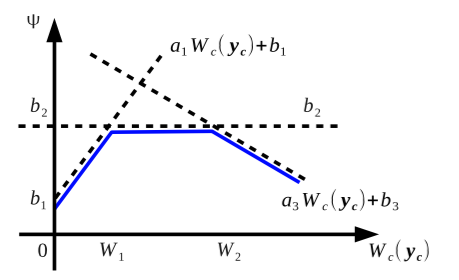

# Optimizing Weighted Lower Linear Envelope Potentials Within Latent-SVM Framework #

## A Story ##

## Large Margin Framework ##

### Binary Support Vector Machine ###

> 
- Margin: perpendicular distance between the decision boundary and the closest data points. 
- Support Vectors: Data points determine the location of this boundary.

### Multi-classes Support Vector Machine ###

$$ 
	\begin{equation*}
\max_{r} \{\mathbf{M_r} \cdot x + 1-\delta_{y,r} \} - \mathbf{M_y} \cdot x
	\end{equation*}
$$

Where $y\in{1,...,k}$ is label of $x$ and $\mathbf{M_r}$ is a $k \times n$ size matrix. $\delta_{p,q}$ equals $1$ if $p==q$ and $0$ otherwise.

### Structral Support Vector Machine ###

### Latent Structral SVM ###
$$
	\begin{equation*}
f_w(x) = \mathop{\arg\,\max}_{(\mathbf{y} \times \mathbf{h}) \in \mathcal{Y} \times \mathcal{H}} w\cdot\Psi(\mathbf{x},\mathbf{y},\mathbf{h})
	\end{equation*}
$$

## Markov Random Field ##

### Markov Random Field ###

$$ 
	\begin{equation*}
    E(x,y) = h\sum_i{x_i} - \beta\sum_{i,j}{x_ix_j}-\eta\sum_i{x_iy_i}
	\end{equation*}
$$

### Higher Order Energy using Linear Envelope###

## Current Work##

### Introducing Latent Variable into Linear Envelope ###
By introducing latent vector $\mathbf{h} = \{h_0, h_1, \dots, h_K\}$where $h_i\in[0,1]$ into feature vector, we have $\phi_c^H(\mathbf{y}_c)=\boldsymbol{\theta}^T\boldsymbol{\psi}(\mathbf{y},\mathbf{h})$ where,
$$
	\begin{equation*}
	\theta_k = \left\{
	\begin{aligned}
	& b_1	& \text{for} \ k=0\\
	& a_1 & \text{for}\ k=1\\
	& a_{k-1}-a_k  & \text{for} \ k=2,\dots,K+1\\
	\end{aligned}
	\right.
	\end{equation*}
$$
$$	
	\begin{equation*}
	\phi_k = \left\{
	\begin{aligned}
	& 1	& \text{for} \ k=0\\
	& W(\mathbf{y}) & \text{for}\ k=1\\
	& \bigg(h_{k-1}-W(\mathbf{y}) \bigg)\bigg[\bigg[ W(\mathbf{y}) > h_{k-1}\bigg]\bigg]  & \text{for} \ k=2,\dots,K+1\\
	\end{aligned}
	\right.
	\end{equation*}
$$

### Remaining Work ###
- Inference Algorithm
- Coding

### Some Experiences###
- A-ha moments keep you going.
- Be prepared for unexpected things.

